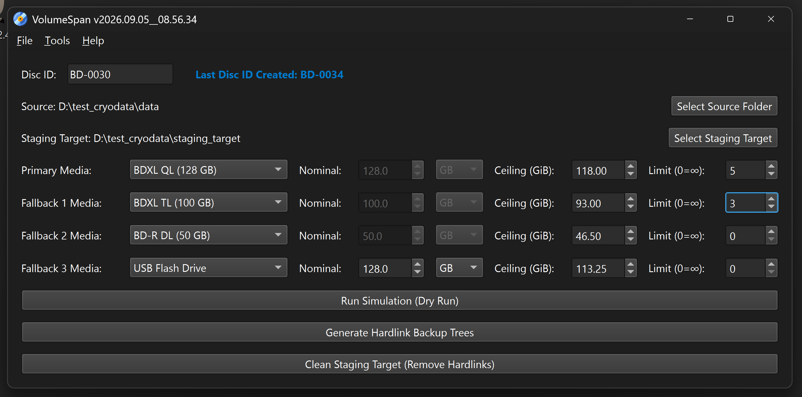

#  VolumeSpan™ 
**An automated optical disc backup staging utility utilizing native NTFS hardlinks.**

---

## Overview
VolumeSpan™ is a backup staging application designed to partition large local directory trees sequentially into fixed-capacity optical disc and removable media volumes (e.g., **BD-0001**, **BD-0002**) using native NTFS hardlinks. It allows you to organize data for optical burning or removable storage—such as BDXL, BD-R, DVD, CD, and USB Flash Drives—without duplicating files or consuming additional hard drive space.

**Primary Environment:** Developed and tested on **Python 3.14.5** using the **PyQt6** framework. It is intended for archivists and system administrators who require deterministic volume splitting, multi-tier fallback capacity management, volume count quotas, and zero-footprint staging.

### The Staging & Partitioning Engine
The utility leverages a sequential bin-packing algorithm paired with NTFS filesystem hardlinks.

Key operational features include:
1. **Zero Storage Duplication:** Staged volume directories are populated using native NTFS hardlinks (`os.link`), which point directly to the underlying file data on disk without consuming additional physical storage space.
2. **Tier Volume Limits & Quotas:** Set an explicit maximum volume count for any tier (where `0` represents unlimited). Once a tier reaches its allocation limit, subsequent volumes automatically transition to the next active fallback tier.
3. **USB Flash & Custom Nominal Sizing:** Automatically calculates real-world safe Windows usable capacities (GiB) from manufacturer decimal ratings (MB / GB) for flash drives and custom storage, compensating for filesystem structures and binary conversion.
4. **Multi-Tier Media Fallbacks:** Configure a primary media target alongside up to three smaller fallback tiers (such as BD-R 25 GB, DVD-9, or USB Flash Drives). When the final tail volume or small initial dataset fits within a smaller tier, VolumeSpan™ automatically steps down the volume size to conserve higher-capacity media.
5. **Deterministic Sequential Partitioning:** Files are processed and allocated in strict directory and alphabetical order. This ensures predictable volume spans and simple restoration (copying volumes sequentially back into a single folder).
6. **Interactive Simulation & Free Space Analysis:** Runs an in-depth pre-staging simulation displaying an interactive tree view with file sizes, remaining free space per volume, media tiers, and capacity fill percentages. Underutilized volumes (< 70% full) are visually alerted in red with a `[< 70% Full]` badge.
7. **Selective Index Reporting:** Export formatted `.txt` catalog reports across the entire backup set using **Save As Index**, or use **Save Index (Exclude Tail)** to catalog only completed volumes while excluding partial tail sets, automatically recalculating volume totals and data metrics.
8. **Tail Volume Tracking & Replenishment:** Real-time main window status tracking displays the exact size and remaining free space of the final staged volume (e.g., `(1.42 GiB / 21.78 GiB) [< 70% Full]`), making it easy to identify partial tail discs ready for replenishment in subsequent batches.
9. **Safe Staging Target Cleanup:** Includes a specialized cleanup utility that traverses staging targets bottom-up, verifying that file link counts are greater than 1 (`st_nlink > 1`) before unlinking. Standalone, non-hardlinked files (`st_nlink == 1`) are strictly preserved to prevent accidental data loss.
10. **Source Purging & Universal Batch Generator:** Safely reclaims disk space on full source drives by permanently deleting files belonging to completed/burned volumes while strictly preserving unburned tail volume files. Features direct in-app native Python deletion as well as an exportable, self-bootstrapping Windows `.bat` script powered by PowerShell that flawlessly handles Unicode, Asian characters, division slashes (`∕`), and explicit `(Y/N)` safety prompts.
11. **Robust Volume & Path Validation:** Enforces strict validation to prevent staging inside the source directory, blocks cross-volume partitioning, and prevents operations across network shares (UNC paths) and mapped network drives.

---

## Feature Reference

| Option | Description |
| :--- | :--- |
| **Disc ID & Tail Tracking** | Defines the starting label (e.g., `BD-0001`), automatically increments volume numbers, and tracks tail volume capacity `(Used / Free)` with real-time `[< 70% Full]` alerts. |
| **Primary Media & Sizing** | Sets the primary media preset (BDXL, BD-R, DVD, CD, USB Flash Drive, or Custom) with automatic sector safety margins and responsive 4K horizontal expansion. |
| **Nominal Size Calculation** | For USB Flash Drives and Custom sizes, auto-calculates safe Windows usable ceilings (GiB) from manufacturer decimal capacities (MB or GB). |
| **Tier Volume Limits** | Sets the maximum volume quota per tier (`0` = unlimited), automatically stepping down subsequent discs to active fallback media once limits are reached. |
| **Multi-Tier Fallbacks** | Configures up to three fallback media tiers with custom capacity thresholds and quotas for automated tail-volume conservation. |
| **1. Run Simulation (Dry Run)** | Interactive allocation breakdown displaying file sizes, remaining free space, media tiers, `< 70% Full` alerts, and dual export options (**Save As Index** and **Save Index (Exclude Tail)**). |
| **2. Generate Hardlinks** | Instantly constructs volume folder hierarchies and zero-byte NTFS hardlinks in the staging folder ready for direct disc authoring or copy. |
| **3. Clean Staging Target** | Safely removes staging directory trees and unlinks hardlinks after burning while strictly preserving original standalone files. |
| **4. Purge Burned Source** | Safely deletes completed volume files from the source drive (pruning empty folders) while strictly preserving unburned tail volume files. Supports direct Python purge and universal, Unicode-safe `.bat` exports. |
| **Theme Engine** | Supports Dark, Light, and System-synced UI modes via a custom QPalette implementation. |

---

## Assets & Licensing
This software is released under the **GNU General Public License v3**.

### Icon Credits
* **File:** `volumespan_cd_icon.svg`
    * **Asset:** Compact Disc Cd SVG Vector
    * **Source:** <a href="https://www.svgrepo.com/svg/224282/compact-disc-cd" target="_blank">https://www.svgrepo.com/svg/224282/compact-disc-cd</a>
    * **License:** <a href="https://creativecommons.org/publicdomain/zero/1.0/" target="_blank">CC0 License</a>
    * **Modifications:** Modified by pwshAgyjkcrg761.

---

## Dependencies
* **OS:** Microsoft Windows 10 / 11 (NTFS file system required).
* **Python:** 3.14.5+ (Recommended).
* **PyQt6:** Required for the Graphical User Interface.

## Support & Maintenance
**This repository is provided "as-is" for archival purposes.** The author is not actively looking for feedback, feature requests, or bug reports. The issue tracker is disabled.

## Disclaimer
*VolumeSpan™ is a backup staging utility. The author is not responsible for data loss resulting from filesystem errors, media degradation, or improper disc burning practices. Always verify backup disc integrity after burning.*

---
> **Document Control** 
> *This document is up-to-date with the following version of VolumeSpan™.* 
> *2026.10.02__14.36.16*